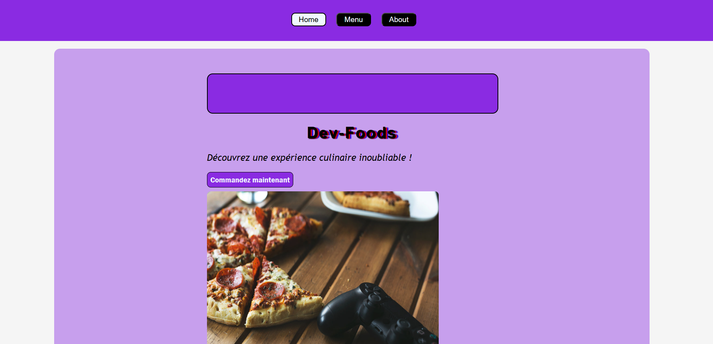
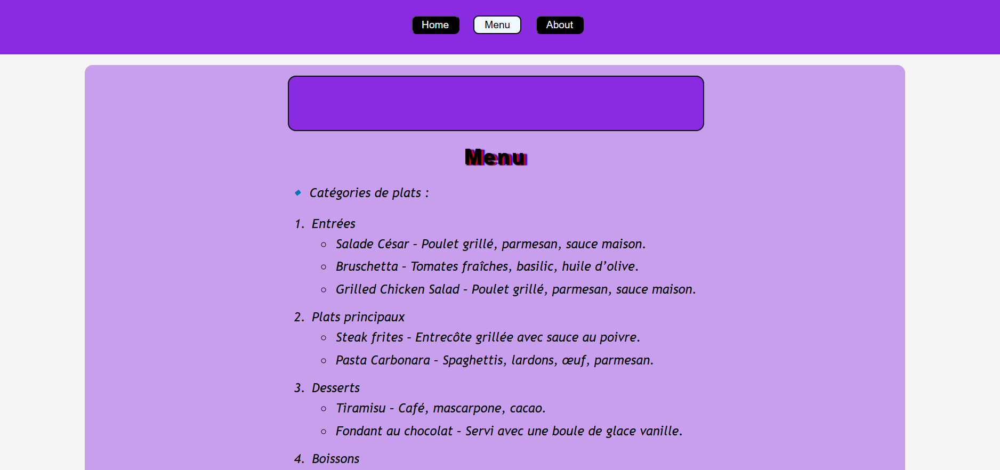
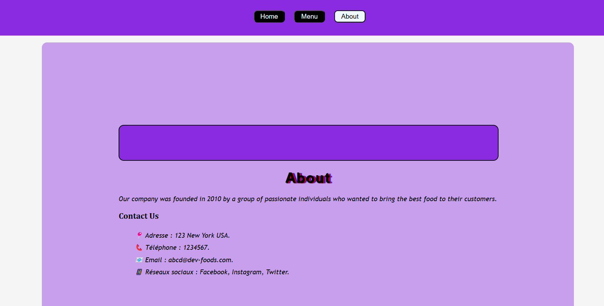

# 🍱Restaurant Page : Dev-Foods
Ce projet est réalisé dans le cadre du parcours Full Stack Developer de [The Odin Project](https://www.theodinproject.com/lessons/node-path-javascript-restaurant-page). Il s'agit d'un site web pour un restaurant. Le contenu est gérer avec du JavaScript
Contient deux branches 
- main pour la production
- gh-pages pour le deployment 

## 🌐Démo
Démo du site ici: [Live](https://lil-code30.github.io/Restaurant-Page/)

## 📺 Résultat

  
  
<em> Home Page</em>

  
  
<em> Menu Page</em>

  
  
<em>About Page</em>

